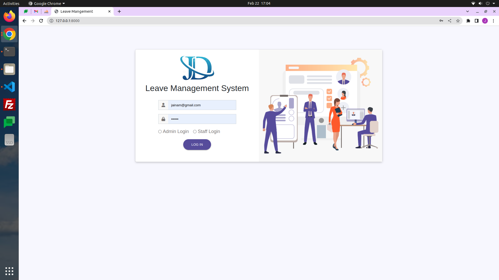
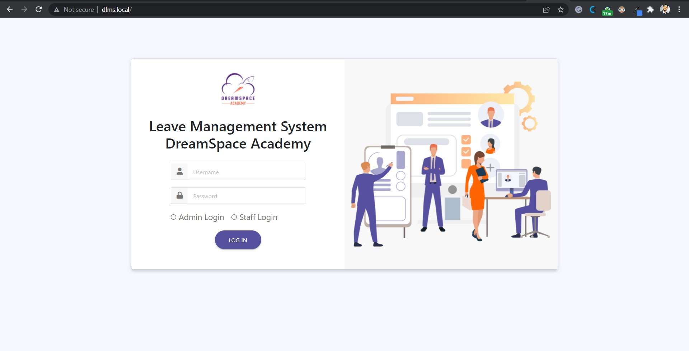
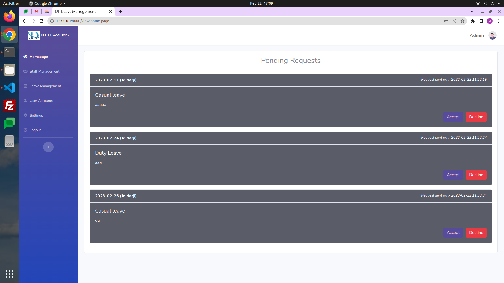
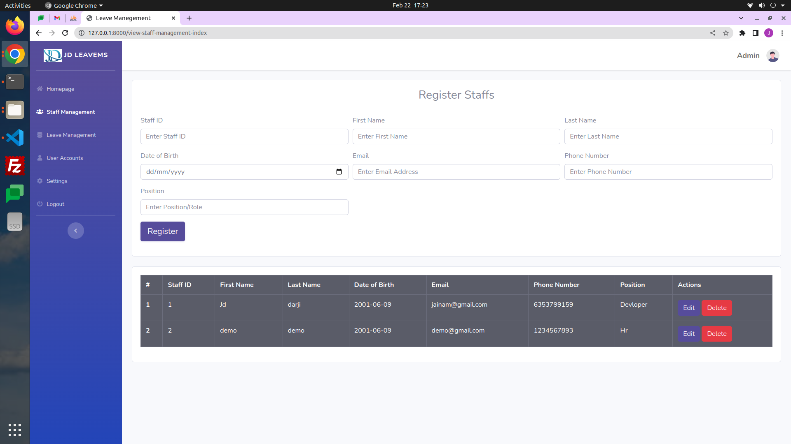
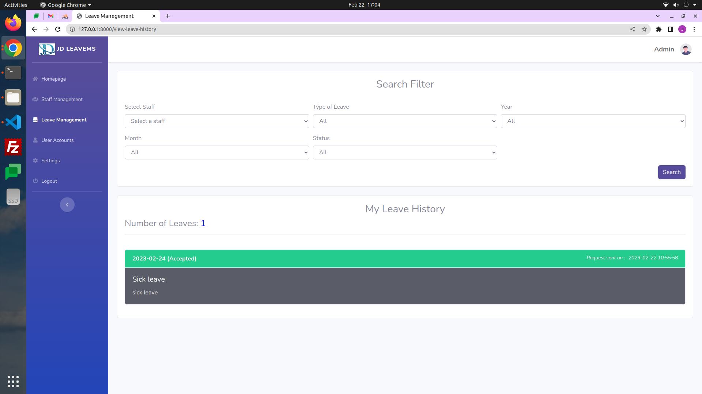
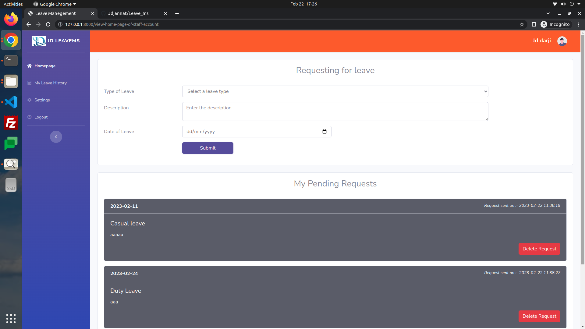
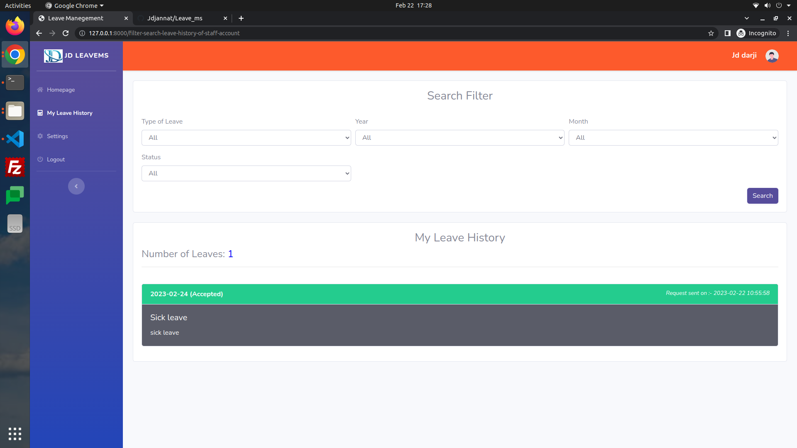

# JD Leave Management System

  

## Introduction

A leave management system is a process within an organization that determines how leave is requested by employees and approved by managers, as well as how it is tracked for payroll, balance, and other purposes.

This leave management system has some basic features such as leave requests, leave tracking, approval and etc.

## Technologies
- Laravel Framework 8.75.0
- MySQL

## Credentials
- Username:- **Jaianm**
- Password:- **Jainam@123**

## Project Explained

### Login Page

This leave management system has two types of accounts those are admin login and staff logins. Admin login has full access of the system whereas staff login has features such as requesting leaves, display previous leave reports and etc.

#### Features
- Admin login
- Staff login
- Login error popup messages

### Admin - Dashboard

The admin dashboard shows up the requested leaves from staffs, here, admin can decide to approve or decline the request.

#### Features
- Display leave requests
- Accept leave requests
- Decline leave requests

### Admin - Staff Management

This admin staff management is the place where the staff details are stored and maintained.  

#### Features
- Insert / register staffs.
- Edit staff details
- Delete staff details
- Display staff details
- Proper popup messages for deletion, update and Insertion.

### Admin - Leave Management

This admin leave management is the place where the leave records are stored and maintained. This module has a filter that cloud be used to filter out leave records properly.

#### Features
- Display all leave reports
- Filter search option - filters leaves records.

### Admin - User Accounts

This admin user account module is the place where staff user accounts are created. This module shows all the registered staff details, from this staffs account username and password can be assigned.

#### Features
- Create user account for staffs.
- Admin can change username and password of staffs.
- Admin can delete user accounts of staffs.

### Admin - Settings

This admin setting module is the place where the admin password and username could be changed.

### Staff - Dashboard

This staff dashboard module is the place where the staff can send leave request to admin. This same module show up pending leave requests.

#### Features
- Request leaves
- Delete pending leave requests

### Staff - My Leave History

This module is the place where the leave records are stored and maintained of a staff. This module has a filter that cloud be used to filter out leave records properly by the staff user.

#### Features
- Display all leave reports of the staff
- Filter search option - filters leaves records.

**Developed by Jainam Darji**

